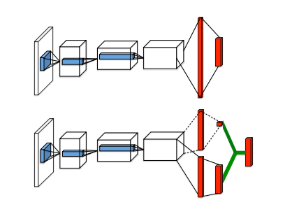
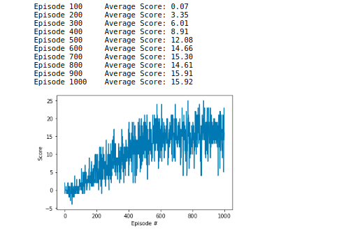
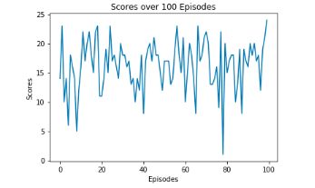

[//]: # (Image References)

[image1]: https://user-images.githubusercontent.com/10624937/42135619-d90f2f28-7d12-11e8-8823-82b970a54d7e.gif "Trained Agent"

# Project 1: Navigation

### Introduction

For this project, you will train an agent to navigate (and collect bananas!) in a large, square world.  

![Trained Agent][image1]

A reward of +1 is provided for collecting a yellow banana, and a reward of -1 is provided for collecting a blue banana.  Thus, the goal of your agent is to collect as many yellow bananas as possible while avoiding blue bananas.  

The state space has 37 dimensions and contains the agent's velocity, along with ray-based perception of objects around agent's forward direction.  Given this information, the agent has to learn how to best select actions.  Four discrete actions are available, corresponding to:
- **`0`** - move forward.
- **`1`** - move backward.
- **`2`** - turn left.
- **`3`** - turn right.

The task is episodic, and in order to solve the environment, your agent must get an average score of +13 over 100 consecutive episodes.

### Getting Started

1. Download the environment from one of the links below.  You need only select the environment that matches your operating system:
    - Linux: [click here](https://s3-us-west-1.amazonaws.com/udacity-drlnd/P1/Banana/Banana_Linux.zip)
    - Mac OSX: [click here](https://s3-us-west-1.amazonaws.com/udacity-drlnd/P1/Banana/Banana.app.zip)
    - Windows (32-bit): [click here](https://s3-us-west-1.amazonaws.com/udacity-drlnd/P1/Banana/Banana_Windows_x86.zip)
    - Windows (64-bit): [click here](https://s3-us-west-1.amazonaws.com/udacity-drlnd/P1/Banana/Banana_Windows_x86_64.zip)
    
    (_For Windows users_) Check out [this link](https://support.microsoft.com/en-us/help/827218/how-to-determine-whether-a-computer-is-running-a-32-bit-version-or-64) if you need help with determining if your computer is running a 32-bit version or 64-bit version of the Windows operating system.

    (_For AWS_) If you'd like to train the agent on AWS (and have not [enabled a virtual screen](https://github.com/Unity-Technologies/ml-agents/blob/master/docs/Training-on-Amazon-Web-Service.md)), then please use [this link](https://s3-us-west-1.amazonaws.com/udacity-drlnd/P1/Banana/Banana_Linux_NoVis.zip) to obtain the environment.

2. Place the file in the DRLND GitHub repository, in the `p1_navigation/` folder, and unzip (or decompress) the file. 

### Instructions

Follow the instructions in `Navigation.ipynb` to get started with training your own agent!  

### Project Details 

In the Banana environment there are yellow and purple bananas laying on the ground and the task of the agent is to collect as many yellow bananas as possible (for each yellow banana +1 Reward) and to avoid the purple ones (-1 Reward).
The observation space vector of the environment has a size of 37 and the discrete action space vector has a size of 4.
The environment is considered to be solved when the trained agent is able to achieve an average score of > 13 over 100 episodes.

### Dueling DQN Architecture

The algorithm behind the agent is a dueling deep Q-Network based of this research paper: [Paper](https://arxiv.org/abs/1511.06581)

In the popular DQN architecture consists of a sigle input-output stream where the network directly predicts the Q-value of a given state. The Dueling DQN architecture has two streams to separately estimate (scalar) state-value (V(s)) and the advantages (A(s,a))for each action. Those two values are combined to calculate the Q-values for a given state respectively to equation: Q(s,a) = V(s) + A(s,a) - mean(A(s,a)).

The actions are chosen greedily with an epsilon-greedy strategy where the epislon decreases over time. Additionaly the agent was trained with a replay memory where several experiences are stored and later sampled and trained from. After every 4 steps the target network gets updated (soft update with tau 0.001).
Other Hyperparameter are:
- gamma =  0.99
- learning rate = 0.0005

### Train the agent 

After 1000 episodes the agent reached an average score of 15.93 and the weights got saved (DuelingDQN_final).

Later to confirm those results the agent was tested (Testing.ipynb) and achieved and average score of 16.27! Therefore successfully solved the project and the task! 

To train your own agent open the "Dueling DQN.ipynb" file and execute all cells. after training for a chosen amount of epochs save the weights of your DQN.

### Future work

To further improve the results I plan to implement a prioritized experience replay memory and add a n-step learning method.
As well I am interested to test a distributional DQN and implement the rainbow DQN.

### (Optional) Challenge: Learning from Pixels

After you have successfully completed the project, if you're looking for an additional challenge, you have come to the right place!  In the project, your agent learned from information such as its velocity, along with ray-based perception of objects around its forward direction.  A more challenging task would be to learn directly from pixels!

To solve this harder task, you'll need to download a new Unity environment.  This environment is almost identical to the project environment, where the only difference is that the state is an 84 x 84 RGB image, corresponding to the agent's first-person view.  (**Note**: Udacity students should not submit a project with this new environment.)

You need only select the environment that matches your operating system:
- Linux: [click here](https://s3-us-west-1.amazonaws.com/udacity-drlnd/P1/Banana/VisualBanana_Linux.zip)
- Mac OSX: [click here](https://s3-us-west-1.amazonaws.com/udacity-drlnd/P1/Banana/VisualBanana.app.zip)
- Windows (32-bit): [click here](https://s3-us-west-1.amazonaws.com/udacity-drlnd/P1/Banana/VisualBanana_Windows_x86.zip)
- Windows (64-bit): [click here](https://s3-us-west-1.amazonaws.com/udacity-drlnd/P1/Banana/VisualBanana_Windows_x86_64.zip)

Then, place the file in the `p1_navigation/` folder in the DRLND GitHub repository, and unzip (or decompress) the file.  Next, open `Navigation_Pixels.ipynb` and follow the instructions to learn how to use the Python API to control the agent.

(_For AWS_) If you'd like to train the agent on AWS, you must follow the instructions to [set up X Server](https://github.com/Unity-Technologies/ml-agents/blob/master/docs/Training-on-Amazon-Web-Service.md), and then download the environment for the **Linux** operating system above.
