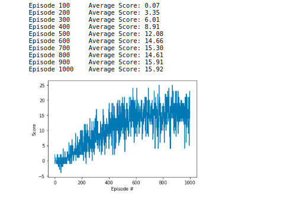

### Dueling DQN Architecture

The algorithm behind the agent is a dueling deep Q-Network based of this research paper: [Paper](https://arxiv.org/abs/1511.06581)

In the popular DQN architecture consists of a sigle input-output stream where the network directly predicts the Q-value of a given state. The Dueling DQN architecture has two streams to separately estimate (scalar) state-value (V(s)) and the advantages (A(s,a))for each action. Those two values are combined to calculate the Q-values for a given state respectively to equation: Q(s,a) = V(s) + A(s,a) - mean(A(s,a)).

The actions are chosen greedily with an epsilon-greedy strategy where the epislon decreases over time. Additionaly the agent was trained with a replay memory where several experiences are stored and later sampled and trained from. After every 4 steps the target network gets updated (soft update with tau 0.001).
Other Hyperparameter are:
- gamma =  0.99
- learning rate = 0.0005

### Train the agent 

After 1000 episodes the agent reached an average score of 15.93 and the weights got saved (DuelingDQN_final).

Later to confirm those results the agent was tested (Testing.ipynb) and achieved and average score of 16.27! Therefore successfully solved the project and the task! 

To train your own agent open the "Dueling DQN.ipynb" file and execute all cells. after training for a chosen amount of epochs save the weights of your DQN.

### Future work

To further improve the results I plan to implement a prioritized experience replay memory and add a n-step learning method.
As well I am interested to test a distributional DQN and implement the rainbow DQN.
